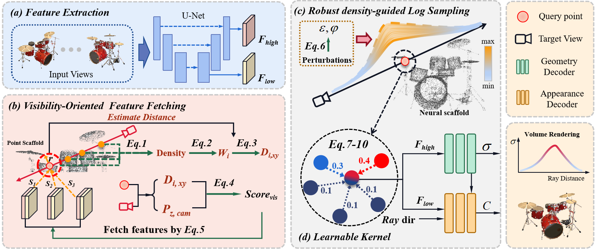

# GPF: Learning Robust Generalizable Radiance Field with Visibility and Feature Augmented Point Representation


PyTorch implementation of paper "[Learning Robust Generalizable Radiance Field with Visibility and Feature Augmented Point Representation](https://iclr.cc/virtual/2024/poster/17836)", ICLR 2024.

 

If you found this project useful, please give us a star ⭐️ or [cite](#citation) us in your paper, this is the greatest support and encouragement for us.

## Installation
```shell
git clone https://github.com/Mercerai/GPF.git
cd GPF
pip install -r requirements.txt
```
<details>
  <summary> Dependencies </summary>

  - torch==1.7.1
  - opencv_python==4.4.0
  - numpy==1.19.2
  - scipy==1.5.2
  - CUDA 11.4 or other version

</details>

## Dataset
1. Download processed datasets: [demo]() including NeRF Synthetic, DTU, and Blendmvs.
2. Download and process raw datasets:[NeRF Synthetic](), [DTU](), and [Blendmvs]()

```shell

```
3. Organize datasets and models as follows

## Pretrained models
1.Download pretrained model:[GPF]()
2.Download finetuned  models:[DTU]()

## Training
```shell

```

## Evaluation
```shell

```
## Finetuning
```shell

```
## Acknowledgements
In this repository, we have used codes or datasets from the following repositories. 
We thank all the authors for sharing great codes or datasets.
- [NeRF-official](https://github.com/bmild/nerf) and [NeRF-torch](https://github.com/yenchenlin/nerf-pytorch)
- [IBRNet](https://github.com/googleinterns/IBRNet)
- [MVSNet-official](https://github.com/YoYo000/MVSNet) 
- [MVSNeRF](https://github.com/apchenstu/mvsnerf)
- [PixelNeRF](https://github.com/sxyu/pixel-nerf)
- [COLMAP](https://github.com/colmap/colmap)
- [DTU](https://roboimagedata.compute.dtu.dk/?page_id=36)
- [BlendedMVS](https://github.com/YoYo000/BlendedMVS)

## Citation
```
@inproceedings{jiaxu2023learning,
  title={Learning Robust Generalizable Radiance Field with Visibility and Feature Augmented Point Representation},
  author={Jiaxu, WANG and Zhang, Ziyi and Xu, Renjing},
  booktitle={The Twelfth International Conference on Learning Representations},
  year={2024}
}

```
